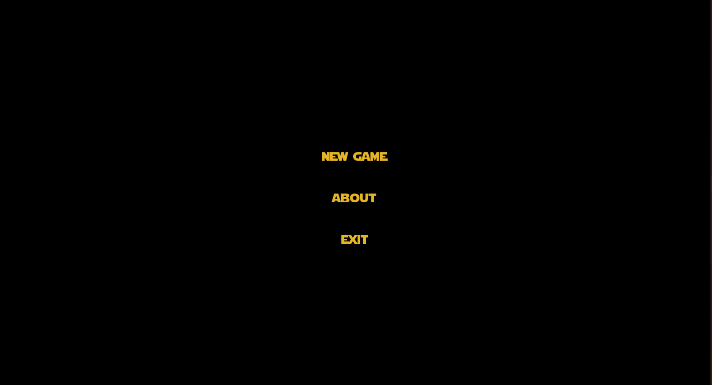

# Моделирование космических полетов
Репозиторий содержит учебный проект курса Компьютерные технологии 4 семестра МФТИ.
Программа воспроизводит гравитационное взаимодействие (Законы Ньютона) между планетами и космическим кораблём. Позволяет управлять кораблём, приземлять его на планету и взлетать с неё же. В программе реализован zoom. 

## Структура кода
Код разделён на 4 директории:
headers - содержит заголовочные файлы классов, функций и т.д
exec - содержит исполняемые файлы
systems - содержит данные по системам планет.
textures - содержит текстуры

## Компилирование sfml проектов
Компиляция происходит с флагом -c
g++ -c main.cpp -o main.o
Далее скомпилированный файл надо связать с sfml. SFML содержит 5 модулей graphics window system audio network
Компилировать с флагом -lsfml-xxx где xxx - требуемый модуль
g++ main.o -o sfml-app -lsfml-graphics -lsfml-window -lsfml-system

Полностью команда выглядит следующим образом:
g++ exec/main.cpp exec/Vector2D.cpp exec/Planet.cpp exec/Ship.cpp exec/calc.cpp exec/menu.cpp -o sfml-app -lsfml-graphics -lsfml-window -lsfml-system
